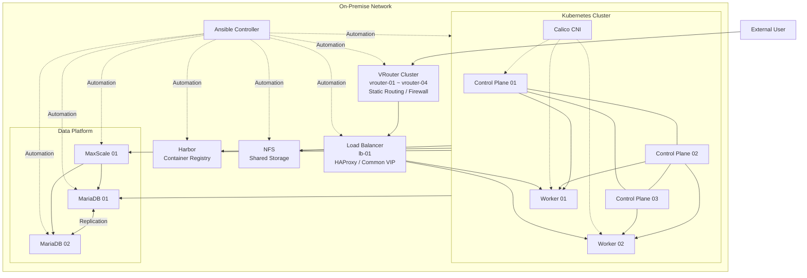

# seokpan-infra

석판팀 1차 프로젝트의 **On-Premise 인프라 구성 및 Ansible 기반 인프라 자동화 Repository**입니다.

본 Repository는 프로젝트 서비스 운영에 필요한 네트워크, 로드밸런서, Kubernetes, 데이터베이스, Container Registry 등의 인프라를 코드로 관리하고, 반복 가능한 구축 및 검증 환경을 만드는 것을 목적으로 합니다.

> **Project:** 인프라 및 애플리케이션 자동화 프로젝트
> **Repository:** `seokpan/seokpan-infra`
> **Environment:** On-Premise / VMware 기반 Lab Environment
> **Automation:** Ansible
> **Container Platform:** Kubernetes
> **Network:** VRouter / Static Routing / HAProxy / Common VIP
> **Database:** MariaDB / MaxScale
> **Registry:** Harbor
> **Storage:** NFS

---

# 1. Project Overview

## 프로젝트 목적

본 프로젝트는 On-Premise 환경에서 웹 서비스를 운영하기 위한 전체 인프라를 구성하고, 이를 **Ansible 기반 IaC(Infrastructure as Code)** 형태로 자동화하는 것을 목표로 합니다.

단순히 서버를 수동으로 구축하는 것이 아니라 다음과 같은 구조를 지향합니다.

```text
Infrastructure
      ↓
Configuration
      ↓
Ansible Automation
      ↓
Validation
      ↓
Repeatable Deployment
```

즉, 실제 환경에서 구축한 인프라를 Ansible Playbook과 Role로 코드화하여 동일하거나 유사한 환경을 반복적으로 구성할 수 있도록 만드는 것이 핵심입니다.

## 주요 구성 영역

* VRouter 및 Static Routing
* Firewall 정책
* HAProxy Load Balancer
* Common VIP
* Kubernetes Cluster
* Calico CNI
* Container Runtime
* MariaDB
* MaxScale
* Harbor Container Registry
* NFS Storage
* Internal CA / CA Trust
* ArgoCD Bootstrap
* Kubernetes Add-ons
* Infrastructure Validation

---

# 2. Architecture

## 전체 인프라 구조



### Architecture 구성

```text
                    External User
                         │
                         ▼
                ┌─────────────────┐
                │     VRouter     │
                │ Routing/Firewall│
                └────────┬────────┘
                         │
                         ▼
                ┌─────────────────┐
                │ HAProxy + VIP    │
                │ Load Balancer    │
                └────────┬────────┘
                         │
              ┌──────────┴──────────┐
              ▼                     ▼
       ┌─────────────┐       ┌─────────────┐
       │ K8s Worker 1│       │ K8s Worker 2│
       └──────┬──────┘       └──────┬──────┘
              │                     │
              └──────────┬──────────┘
                         │
                  Kubernetes Cluster
                         │
          ┌──────────────┼──────────────┐
          ▼              ▼              ▼
       MariaDB         MaxScale       Harbor
       Cluster                        Registry
          │
          ▼
         NFS
       Storage
```

---

# 3. Infrastructure

현재 프로젝트는 **총 16VM**을 기반으로 구성합니다.

| Category      | Host        | IP            | Role               | 주요 역할                       |
| ------------- | ----------- | ------------- | ------------------ | --------------------------- |
| Network       | vrouter-01  | 10.1.93.71    | VRouter            | Routing / Firewall          |
| Network       | vrouter-02  | 10.1.93.73    | VRouter            | Routing / Firewall          |
| Network       | vrouter-03  | 10.1.93.75    | VRouter            | Routing / Firewall          |
| Network       | vrouter-04  | 10.1.93.77    | VRouter            | Routing / Firewall          |
| Kubernetes    | cp-01       | 192.168.51.20 | Control Plane      | Kubernetes Control Plane    |
| Kubernetes    | cp-02       | 192.168.52.20 | Control Plane      | Kubernetes Control Plane    |
| Kubernetes    | cp-03       | 192.168.53.20 | Control Plane      | Kubernetes Control Plane    |
| Kubernetes    | worker-01   | 192.168.51.30 | Worker             | Application Workload        |
| Kubernetes    | worker-02   | 192.168.52.30 | Worker             | Application Workload        |
| Database      | mariadb-01  | 192.168.52.40 | MariaDB            | Database Node               |
| Database      | mariadb-02  | 192.168.51.40 | MariaDB            | Database Node / Replication |
| Database      | maxscale-01 | 192.168.53.40 | MaxScale           | DB Proxy / Routing          |
| Load Balancer | lb-01       | 10.1.93.78    | HAProxy            | Load Balancing / Common VIP |
| Registry      | harbor      | 192.168.53.61 | Harbor             | Container Image Registry    |
| Storage       | nfs         | 192.168.54.50 | NFS                | Shared Storage / Backup     |
| Management    | ansible     | 192.168.54.70 | Ansible Controller | Infrastructure Automation   |

> IP 및 Host 정보는 현재 Ansible Inventory 기준입니다. Inventory 변경 시 본 문서의 Infrastructure Table도 함께 갱신합니다.

---

# 4. Repository Structure

현재 Repository는 Ansible의 **Inventory → Playbook → Role** 구조를 중심으로 구성되어 있습니다.

```text
seokpan-infra/
│
├── .github/
│   ├── ISSUE_TEMPLATE/
│   │   └── task.md
│   └── pull_request_template.md
│
├── ansible/
│   │
│   ├── ansible.cfg
│   │
│   ├── bootstrap/
│   │   ├── README.md
│   │   └── version_lock_bootstrap.sh
│   │
│   ├── inventory/
│   │   ├── hosts.yml
│   │   │
│   │   ├── group_vars/
│   │   │   └── all/
│   │   │       ├── vars.yml
│   │   │       └── vault.yml
│   │   │
│   │   └── host_vars/
│   │       ├── harbor/
│   │       ├── lb-01/
│   │       ├── mariadb-01/
│   │       ├── mariadb-02/
│   │       ├── vrouter-01/
│   │       ├── vrouter-02/
│   │       ├── vrouter-03/
│   │       └── vrouter-04/
│   │
│   ├── playbooks/
│   │   ├── argocd_bootstrap.yml
│   │   ├── ca_trust.yml
│   │   ├── check.yml
│   │   ├── common.yml
│   │   ├── common_hosts.yml
│   │   ├── container_runtime.yml
│   │   ├── controller_kubeconfig.yml
│   │   ├── harbor.yml
│   │   ├── internal_ca.yml
│   │   ├── kubernetes_addons.yml
│   │   ├── kubernetes_calico.yml
│   │   ├── kubernetes_cluster.yml
│   │   ├── kubernetes_prereq.yml
│   │   └── kubernetes_validate.yml
│   │
│   └── roles/
│       ├── argocd_bootstrap/
│       ├── ca_trust/
│       ├── calico/
│       ├── common/
│       ├── common_hosts/
│       ├── container_runtime/
│       ├── controller_kubeconfig/
│       ├── harbor/
│       ├── internal_ca/
│       ├── jenkins_secrets/
│       ├── k8s_addons/
│       ├── kubeadm_control_plane/
│       ├── kubeadm_control_plane_join/
│       ├── kubeadm_worker/
│       ├── kubernetes_prereq/
│       ├── lb_haproxy/
│       └── ...
│
├── .gitignore
└── README.md
```

## 주요 디렉터리 역할

### `.github/`

GitHub 협업에 필요한 Issue Template 및 Pull Request Template을 관리합니다.

```text
.github/
├── ISSUE_TEMPLATE/
│   └── task.md
└── pull_request_template.md
```

### `ansible/inventory/`

관리 대상 서버와 환경별 변수를 관리합니다.

```text
inventory/
├── hosts.yml
├── group_vars/
└── host_vars/
```

* `hosts.yml` : 서버 그룹 및 접속 정보
* `group_vars/` : 그룹 공통 변수
* `host_vars/` : 특정 Host 전용 변수
* `vault.yml` : Password 등 민감정보 관리

### `ansible/playbooks/`

인프라 구성 작업의 실행 진입점입니다.

예:

```text
kubernetes_prereq.yml
        ↓
container_runtime.yml
        ↓
kubernetes_cluster.yml
        ↓
kubernetes_calico.yml
        ↓
kubernetes_addons.yml
        ↓
kubernetes_validate.yml
```

### `ansible/roles/`

실제 구성 작업을 기능 단위로 분리합니다.

예:

```text
kubeadm_control_plane
kubeadm_control_plane_join
kubeadm_worker
calico
container_runtime
lb_haproxy
harbor
argocd_bootstrap
```

Playbook이 **"무엇을 실행할 것인가"**를 정의한다면 Role은 **"어떻게 구성할 것인가"**를 담당합니다.

---

# 5. Deployment Order

전체 인프라는 의존성을 고려하여 다음 순서로 구축하는 것을 기본 원칙으로 합니다.

```text
┌──────────────────────────────┐
│ 1. Bootstrap                 │
│ OS / Repository / SSH / 기본환경 │
└──────────────┬───────────────┘
               ▼
┌──────────────────────────────┐
│ 2. Common Configuration      │
│ Hostname / Hosts / 공통 설정 │
└──────────────┬───────────────┘
               ▼
┌──────────────────────────────┐
│ 3. Network                   │
│ VRouter / Static Routing     │
│ Firewall                     │
└──────────────┬───────────────┘
               ▼
┌──────────────────────────────┐
│ 4. Load Balancer             │
│ HAProxy / Common VIP         │
└──────────────┬───────────────┘
               ▼
┌──────────────────────────────┐
│ 5. Kubernetes Prerequisite   │
│ Kernel / Sysctl / Packages   │
└──────────────┬───────────────┘
               ▼
┌──────────────────────────────┐
│ 6. Container Runtime         │
│ containerd                   │
└──────────────┬───────────────┘
               ▼
┌──────────────────────────────┐
│ 7. Kubernetes Cluster        │
│ Control Plane / Worker       │
└──────────────┬───────────────┘
               ▼
┌──────────────────────────────┐
│ 8. CNI                       │
│ Calico                       │
└──────────────┬───────────────┘
               ▼
┌──────────────────────────────┐
│ 9. Kubernetes Add-ons        │
│ Cluster Add-ons              │
└──────────────┬───────────────┘
               ▼
┌──────────────────────────────┐
│ 10. Platform Services        │
│ Harbor / Internal CA         │
└──────────────┬───────────────┘
               ▼
┌──────────────────────────────┐
│ 11. Data Platform            │
│ MariaDB / MaxScale / NFS     │
└──────────────┬───────────────┘
               ▼
┌──────────────────────────────┐
│ 12. Delivery Platform        │
│ ArgoCD / Jenkins             │
└──────────────┬───────────────┘
               ▼
┌──────────────────────────────┐
│ 13. Validation               │
│ Infrastructure Validation    │
└──────────────────────────────┘
```

## 주요 실행 순서

### 1. Bootstrap

```bash
cd ansible

ansible-playbook playbooks/common_hosts.yml
```

OS 및 Ansible 실행에 필요한 기본 환경을 준비합니다.

---

### 2. Kubernetes Prerequisite

```bash
ansible-playbook playbooks/kubernetes_prereq.yml
```

Kubernetes 노드에 필요한 OS 및 Kernel 설정을 구성합니다.

---

### 3. Container Runtime

```bash
ansible-playbook playbooks/container_runtime.yml
```

Kubernetes에서 사용할 `containerd` 환경을 구성합니다.

---

### 4. Kubernetes Cluster

```bash
ansible-playbook playbooks/kubernetes_cluster.yml
```

Control Plane 및 Worker Node를 이용하여 Kubernetes Cluster를 구성합니다.

---

### 5. Calico

```bash
ansible-playbook playbooks/kubernetes_calico.yml
```

Kubernetes Pod Network를 위한 Calico CNI를 구성합니다.

---

### 6. Kubernetes Add-ons

```bash
ansible-playbook playbooks/kubernetes_addons.yml
```

Cluster 운영에 필요한 Add-on을 구성합니다.

---

### 7. Harbor

```bash
ansible-playbook playbooks/harbor.yml
```

Container Image Registry 환경을 구성합니다.

---

### 8. Internal CA / CA Trust

```bash
ansible-playbook playbooks/internal_ca.yml

ansible-playbook playbooks/ca_trust.yml
```

내부 인증서 및 각 노드의 CA Trust 환경을 구성합니다.

---

### 9. ArgoCD

```bash
ansible-playbook playbooks/argocd_bootstrap.yml
```

GitOps 기반 배포 환경을 위한 ArgoCD Bootstrap을 수행합니다.

---

### 10. Validation

```bash
ansible-playbook playbooks/kubernetes_validate.yml
```

구축된 Kubernetes 환경의 주요 상태를 검증합니다.

---

# 6. Current Status

현재 프로젝트는 **Infrastructure 구축 상태와 Ansible Automation 구현 상태를 별도로 관리**합니다.

> `Infrastructure`가 실제 서버에 구축되어 있다고 해서 해당 환경이 Ansible로 완전히 재현 가능한 것은 아닙니다.

## 6.1 Infrastructure Status

| 영역            | 구성 요소             | 상태      |
| ------------- | ----------------- | ------- |
| Network       | 4 × VRouter       | 🟢 구성   |
| Network       | Static Routing    | 🟢 구성   |
| Network       | Firewall          | 🟢 구성   |
| Load Balancer | HAProxy           | 🟢 구성   |
| Load Balancer | Common VIP        | 🟢 구성   |
| Kubernetes    | 3 × Control Plane | 🟢 구성   |
| Kubernetes    | 2 × Worker        | 🟢 구성   |
| Kubernetes    | Calico            | 🟢 구성   |
| Database      | MariaDB 01        | 🟢 구성   |
| Database      | MariaDB 02        | 🟢 구성   |
| Database      | MaxScale          | 🟢 구성   |
| Registry      | Harbor            | 🟡 진행 중 |
| Storage       | NFS               | 🟡 진행 중 |
| Delivery      | ArgoCD            | 🟡 진행 중 |
| Delivery      | Jenkins           | 🟡 진행 중 |
| Monitoring    | Monitoring Stack  | 🟡 진행 중 |

---

## 6.2 Ansible Automation Status

| 영역            | Playbook / Role                     | 자동화 상태 |
| ------------- | ----------------------------------- | ------ |
| Common        | `common_hosts.yml` / `common_hosts` | 🟢     |
| Network       | VRouter Network / Routing           | 🟡     |
| Network       | VRouter Firewall                    | 🟡     |
| Load Balancer | `lb_haproxy`                        | 🟢     |
| Kubernetes    | `kubernetes_prereq`                 | 🟢     |
| Kubernetes    | `container_runtime`                 | 🟢     |
| Kubernetes    | `kubeadm_control_plane`             | 🟢     |
| Kubernetes    | `kubeadm_control_plane_join`        | 🟢     |
| Kubernetes    | `kubeadm_worker`                    | 🟢     |
| Kubernetes    | `calico`                            | 🟢     |
| Kubernetes    | `k8s_addons`                        | 🟢     |
| Kubernetes    | Validation                          | 🟢     |
| Registry      | `harbor`                            | 🟢     |
| Security      | `internal_ca`                       | 🟢     |
| Security      | `ca_trust`                          | 🟢     |
| Delivery      | `argocd_bootstrap`                  | 🟢     |
| Delivery      | `jenkins_secrets`                   | 🟡     |
| Database      | MariaDB / MaxScale                  | 🟡     |
| Storage       | NFS                                 | 🟡     |

### Status 기준

```text
🟢 완료
   └─ Playbook / Role 구현 및 테스트가 완료된 영역

🟡 진행 중
   └─ 구현 또는 테스트가 진행 중인 영역

⚪ 예정
   └─ 향후 자동화 대상

🔴 문제 발생
   └─ 현재 해결이 필요한 영역
```

---

# 7. Ansible Execution

Ansible 작업은 `ansible/` 디렉터리를 기준으로 수행합니다.

```bash
cd ansible
```

## Inventory 확인

```bash
ansible-inventory -i inventory/hosts.yml --graph
```

## Host 연결 확인

```bash
ansible all -i inventory/hosts.yml -m ping
```

## Playbook 문법 검사

```bash
ansible-playbook \
  -i inventory/hosts.yml \
  playbooks/kubernetes_cluster.yml \
  --syntax-check
```

## Check Mode

실제 변경 없이 예상 변경사항을 확인합니다.

```bash
ansible-playbook \
  -i inventory/hosts.yml \
  playbooks/kubernetes_cluster.yml \
  --check --diff
```

## Playbook 실행

```bash
ansible-playbook \
  -i inventory/hosts.yml \
  playbooks/kubernetes_cluster.yml
```

---

# 8. Security

Repository에는 다음과 같은 민감정보를 저장하지 않습니다.

* Password
* Token
* Private Key
* kubeconfig Credential
* TLS Private Key
* 기타 인증 정보

민감한 변수는 Ansible Vault를 사용하여 관리합니다.

```text
inventory/
└── group_vars/
    └── all/
        ├── vars.yml
        └── vault.yml
```

Vault 파일 및 민감정보가 포함된 파일은 Git에 평문으로 Commit하지 않는 것을 원칙으로 합니다.

---

# 9. Collaboration Workflow

팀 작업은 다음 GitHub Workflow를 기본으로 합니다.

```text
Issue
  ↓
Branch
  ↓
Commit
  ↓
Pull Request
  ↓
Code Review
  ↓
Squash Merge
  ↓
main
```

## Branch Naming

```text
feature/<component>-<description>
fix/<component>-<description>
docs/<description>
refactor/<component>-<description>
```

예:

```text
feature/k8s-calico
feature/harbor-tls
fix/maxscale-replication
docs/readme-update
```

## Commit

하나의 Commit에는 가능한 한 하나의 작업 목적만 포함합니다.

예:

```text
feat: add kubernetes worker role
fix: correct haproxy backend port
docs: update infrastructure architecture
refactor: split common host variables
```

---

# 10. Repository 운영 원칙

본 Repository는 단순한 Ansible Script 저장소가 아니라 **Infrastructure as Code Repository**를 지향합니다.

따라서 다음 원칙을 유지합니다.

### 1. 반복 가능한 구성

수동으로 변경한 환경을 그대로 두지 않고 가능한 경우 Ansible 코드로 반영합니다.

### 2. 역할별 분리

하나의 거대한 Playbook보다 기능별 Role을 사용하여 재사용성과 유지보수성을 확보합니다.

### 3. 환경과 로직 분리

```text
Inventory
   │
   ├── hosts.yml
   ├── group_vars
   └── host_vars
          │
          ▼
      Playbook
          │
          ▼
         Role
```

### 4. 검증 가능한 자동화

자동화가 성공적으로 실행되었더라도 실제 서비스 상태를 별도로 검증합니다.

```text
Automation
    ↓
Configuration
    ↓
Validation
    ↓
Service Test
```

### 5. Infrastructure와 Automation 상태 분리

```text
Infrastructure Status
    ≠
Automation Status
```

실제 VM에 수동으로 구축된 환경과 Ansible을 이용해 처음부터 재구축할 수 있는 환경은 동일한 개념으로 취급하지 않습니다.

---

# 11. Future Improvements

향후 다음 영역을 추가하여 Repository의 자동화 수준을 높이는 것을 목표로 합니다.

* [ ] 전체 Infrastructure Bootstrap 자동화
* [ ] VRouter Network / Firewall 자동화 완성
* [ ] MariaDB / MaxScale 자동화
* [ ] NFS 자동화
* [ ] Jenkins 자동화
* [ ] Monitoring Stack 자동화
* [ ] 전체 Infrastructure Validation 자동화
* [ ] Disaster Recovery / Backup 자동화
* [ ] Playbook Idempotency 검증
* [ ] CI 기반 Ansible Syntax Check
* [ ] CI 기반 Ansible Lint
* [ ] Infrastructure 재현성 테스트

---

# 12. Project Goal

최종적으로 다음과 같은 형태의 **재현 가능한 On-Premise Infrastructure Automation Platform**을 구축하는 것을 목표로 합니다.

```text
                 GitHub Repository
                         │
                         ▼
                  Ansible Playbook
                         │
                         ▼
                ┌─────────────────┐
                │ Infrastructure  │
                │   Automation    │
                └────────┬────────┘
                         │
          ┌──────────────┼──────────────┐
          ▼              ▼              ▼
       Network       Kubernetes      Data
       Platform       Platform      Platform
          │              │              │
          ▼              ▼              ▼
      VRouter        K8s Cluster     MariaDB
      HAProxy        Calico          MaxScale
      Common VIP     Add-ons         NFS
                         │
                         ▼
                  Application Platform
                         │
                  ┌──────┴──────┐
                  ▼             ▼
                Harbor        ArgoCD
```

**목표는 단순히 "서버를 구성하는 것"이 아니라,
코드로 인프라를 구성하고 검증하며 필요할 경우 동일한 환경을 다시 구축할 수 있는 상태를 만드는 것입니다.**

