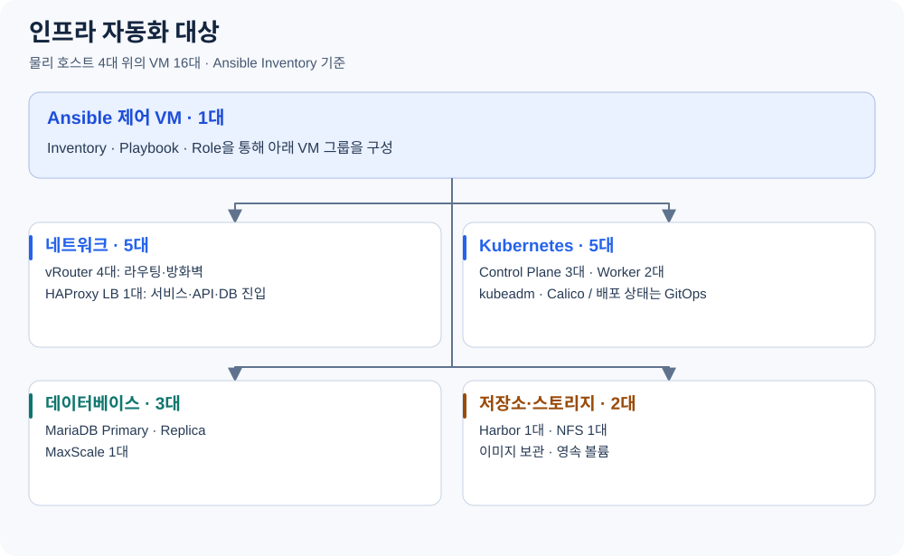

# seokpan-infra

**「石나가는 판단(Seokpan)」 프로젝트의 서버·네트워크·데이터베이스·Kubernetes 기반 인프라를 Ansible로 자동화하는 저장소입니다.** 온프레미스 VMware/CentOS Stream 9 환경(4 PC, 다수 VM) 위에 라우팅/방화벽부터 K8s 클러스터, MariaDB/MaxScale, NFS, 백업·DR, Observability Exporter까지 코드로 관리합니다.

실제 애플리케이션 배포 상태는 [`seokpan-gitops`](https://github.com/seokpan/seokpan-gitops), 애플리케이션 소스는 [`seokpan-app`](https://github.com/seokpan/seokpan-app), 설계·검증 문서는 [`seokpan-docs`](https://github.com/seokpan/seokpan-docs)에서 관리합니다.

## 인프라 구성



[Inventory](ansible/inventory/hosts.yml)에 정의된 16개 VM을 역할별로 묶은 그림입니다. Control Plane 3대·Worker 2대로 Kubernetes를 구성하고, MariaDB·MaxScale·Harbor·NFS는 별도 VM에서 운영합니다. 1차 MVP의 LB와 MaxScale은 각각 1대입니다.

Ansible은 서버와 클러스터 기반을 구성하고, 클러스터에 배포할 애플리케이션·플랫폼 리소스는 `seokpan-gitops`가 관리합니다. 그림은 관리 대상의 구분이며 패킷 경로나 물리 호스트별 배치를 나타내지는 않습니다.

## 담당과 역할

| 담당자 | 영역 | 주요 작업 |
|---|---|---|
| **정태훈** (팀장) | Kubernetes, 코드 리뷰 | `kubeadm_*`, `container_runtime`, `calico`, `k8s_addons` |
| **이유빈** | Network / Ansible 실행환경 | `vrouter_network`, `vrouter_firewall`, `lb_network`, `lb_haproxy`, `common_hosts` |
| **최유준** | Harbor / Argo CD / CI-CD / Observability, `internal_ca`·`tls_deploy` 소유 | `harbor`, `argocd_bootstrap`, `internal_ca`, `tls_deploy`, Exporter 계열 |
| **김상희** | Data, Storage & Recovery | `mariadb*`, `maxscale*`, `nfs_server`, `backup_transfer`, `etcd_dr` |

## 저장소 구조

```text
seokpan-infra/
├── .github/                  # Issue/PR 템플릿
└── ansible/
    ├── ansible.cfg
    ├── ansible-safe-run       # 안전 실행 래퍼 스크립트
    ├── bootstrap/             # 최초 실행 준비(컬렉션/버전 락 등)
    ├── inventory/             # hosts.yml, group_vars/, host_vars/
    ├── playbooks/             # 역할별 실행 진입점
    ├── roles/                 # 기능 단위 자동화 코드
    ├── tools/
    ├── requirements.txt
    └── requirements.yml
```

## 핵심 기술과 구현 영역

VMware·CentOS Stream 9 VM을 Ansible로 구성하고, HAProxy·kubeadm·containerd·Calico·MariaDB·MaxScale·NFS를 영역별 Role로 관리합니다. 전체 목록 대신 대표 코드 위치만 안내합니다. 각 Role의 세부 태스크는 링크된 디렉터리에서 확인할 수 있습니다.

| 영역 | 대표 Role / Playbook | 코드 |
|---|---|---|
| 네트워크 · LB | `vrouter_network`, `vrouter_firewall`, `lb_haproxy`, `resolver_policy`, `coredns_records` | [roles/](ansible/roles) |
| Kubernetes 부트스트랩 | `kubernetes_prereq`, `container_runtime`, `calico`, `kubeadm_control_plane(_join)`, `kubeadm_worker`, `k8s_addons` | [roles/](ansible/roles) |
| 인증서 · TLS | `internal_ca`, `tls_deploy`, `ca_trust`, `certbot_client`, `gateway_tls` | [roles/](ansible/roles) |
| 데이터베이스 (김상희) | `mariadb`, `mariadb_account`, `mariadb_database`, `mariadb_user`, `maxscale` | [roles/mariadb](ansible/roles/mariadb), [roles/maxscale](ansible/roles/maxscale) |
| 백업 · DR (김상희) | `backup_transfer`, `etcd_dr`, `etcd_tools` | [playbooks/mariadb_dr_recovery.yml](ansible/playbooks/mariadb_dr_recovery.yml), [playbooks/mariadb_restore_chain.yml](ansible/playbooks/mariadb_restore_chain.yml), [playbooks/etcd_dr_recovery.yml](ansible/playbooks/etcd_dr_recovery.yml) |
| 저장소 (김상희) | `nfs_server` | [roles/nfs_server](ansible/roles/nfs_server) |
| CI/CD 연동 시크릿 | `harbor`, `jenkins_secrets`, `argocd_bootstrap`, `argocd_webhook_secret`, `application_registry_secret`, `backend_db_secrets` | [roles/](ansible/roles) |
| Observability | `node_exporter_linux`, `mysqld_exporter`, `maxscale_exporter`, `alertmanager_secret` | [roles/](ansible/roles) |

> Primary/Replica가 `auto_failover=true`로 동적으로 바뀌는 등, 설계와 실제 서버 상태가 다를 수 있는 지점은 `seokpan-docs`의 인프라 스냅샷 문서를 최신 기준으로 삼습니다(아래 관련 문서 참고).

## 실행 방법

```bash
cd ansible
ansible-galaxy install -r requirements.yml
ansible-playbook -i inventory/hosts.yml playbooks/<playbook>.yml --check --diff   # dry-run 먼저 확인
ansible-playbook -i inventory/hosts.yml playbooks/<playbook>.yml
```

비밀번호·인증서 등 민감 값은 Ansible Vault(`group_vars/all/vault.yml`)로만 관리하며, `diff: false`가 적용된 태스크는 `--check --diff`에서도 평문이 노출되지 않도록 되어 있습니다. `.gitignore`로 로컬 산출물 커밋도 차단합니다.

## 저장소 간 관계

| 저장소 | 역할 |
|---|---|
| `seokpan-infra` | 서버 / 네트워크 / DB / K8s 부트스트랩 자동화 (본 저장소) |
| `seokpan-gitops` | Kubernetes Desired State, Argo CD |
| `seokpan-app` | 애플리케이션 소스 (Frontend/Backend) |
| `seokpan-docs` | 아키텍처 설계, 트러블슈팅, 검증 기록 |

## 관련 문서 (`seokpan-docs`)

- [논리 아키텍처](https://github.com/seokpan/seokpan-docs/tree/main/logical-architecture) · [물리 아키텍처](https://github.com/seokpan/seokpan-docs/tree/main/physical-architecture)
- [MVP 구현 기준](https://github.com/seokpan/seokpan-docs/blob/main/MVP_IMPLEMENTATION_BASELINE.md)
- [프로젝트 변경 기록](https://github.com/seokpan/seokpan-docs/blob/main/PROJECT_CHANGES.md)
- [트러블슈팅 모음](https://github.com/seokpan/seokpan-docs/tree/main/troubleshooting)
- [GitHub 협업 및 Repository 운영](<https://github.com/seokpan/seokpan-docs/tree/main/10_GitHub_협업_및_Repository_운영>)

## 작업 방법

Issue 등록 → 작업 브랜치 → 실서버(dry-run 포함) 검증 → 작은 단위 PR → 리뷰 → `main` merge 순으로 진행합니다. 브랜치 생성/커밋/push 등 Git 조작은 팀원이 직접 수행하고, PR/Issue 본문은 사전 확인 후 등록하는 것을 원칙으로 합니다.
